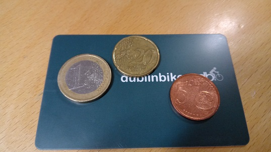
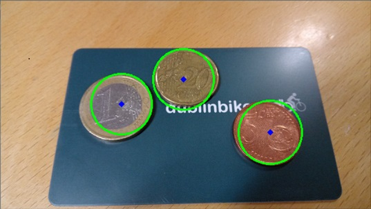
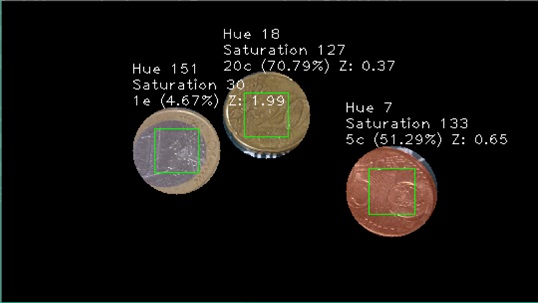

**Euro Coin Detector**
========================

Introduction
------------------------
This project aims to develop a Euro Coin Detector that can recognize euro coins from natural images and classify them according to their coin denomination and tell their values.  

This project consists of 4 conponents:  
1) Euro Coin Classifier
    The classifier is developed using artificial intelligence and machine learning technologies. The classifier uses a large amount of images of the euro coin series of each denomination to describe each euro coin type's attributes, such as their shape, size, color, patterns, etc. This is used to generalize the euro coins so later the classifier could be used to determine whether or not an arbitary object is a certain denomination of euro coin.  
2) Euro Coin Detector
    This program uses image processing and computer vision technologies to recognize the euro coins from natural images. Statistical calculations are used in the euro coin detection algorithm, with the previous trained Euro Coin Classifier, to determine the probabilities of the object classification.
3) Euro Coin Detection Service API
	This is a web-based API to allow other developers to easily implement this euro coin detection technology in their own projects. 
4) Euro Coin Detection Demo Mobile App
	This is a simple Apache Cordova based mobile app to demonstrate how this works in a mobile app.

Results
------------------------
| Original | Processed | Result |
| :---: | :---: | :---: |
|  |  |  |

Licensing
------------------------
Please see the file named [LICENSE.md](LICENSE.md).

Author
------------------------
* Chen Yumin  

Contact
------------------------
* Chen Yumin: [*http://chenyumin.com/*][1]
* CharmySoft: [*http://CharmySoft.com/*][2]  
* About: [*http://CharmySoft.com/about*][3]  
* Email: [*hello@chenyumin.com*](mailto:hello@chenyumin.com)  

[1]: http://chenyumin.com/ "Chen Yumin"
[2]: http://www.CharmySoft.com/ "CharmySoft"
[3]: http://www.CharmySoft.com/about "About CharmySoft"